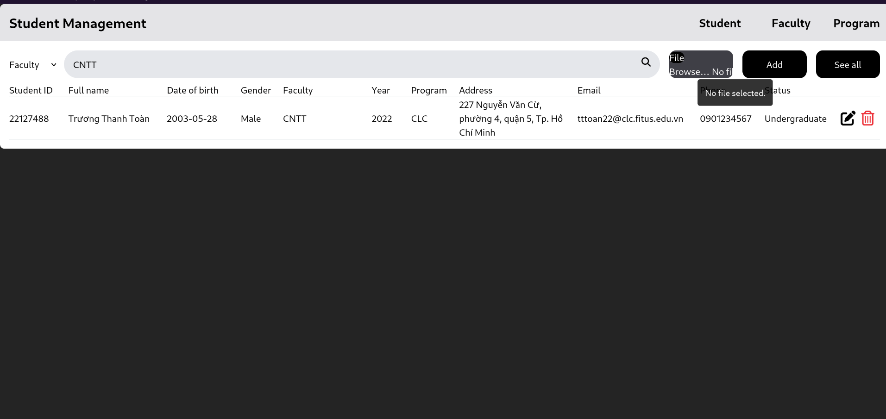

# Source
- Gồm hai phần FrontEnd (ts, react, vite, axios) và BackEnd (ts, node, express)
- Theo MVC model

# How to run (latest)
## Front end
- Navigate đến folder FrontEnd
- Chạy `npm i` để tải packages
- Sau đó chạy `npm run dev` và truy cập vào đường dẫn thể hiện trên console
## Back end
- Navigate đến folder BackEnd
- Chạy `npm i` để tải packages
- Sau đó chạy `npm run dev` và truy cập vào đường dẫn thể hiện trên console

# Minh chứng
## Lưu trữ database

## Thêm khoa, chương trình

## Tìm kiếm theo khoa

## Import file

## Log

## Chưa hoàn thành
- Tìm kiếm nâng cao theo khoa + tên sinh viên
- Chưa hiểu chức năng "show version và ngày build ứng dụng"